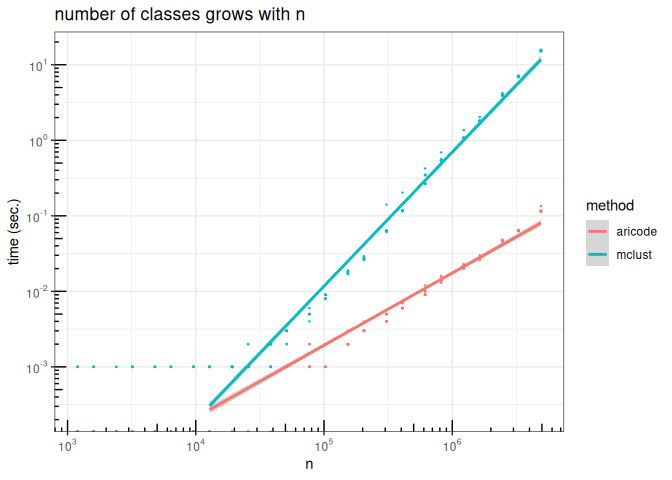

# aricode: a package for efficient computations of standard clustering comparison measures

[](https://travis-ci.org/jchiquet/aricode)
[](https://CRAN.R-project.org/package=aricode)
[](https://codecov.io/gh/jchiquet/aricode)

## Installation

Stable version on the
[CRAN](https://cran.rstudio.com/web/packages/aricode/).

``` r
install.packages("aricode")
```

The development version is available via:

``` r
devtools::install_github("jchiquet/aricode")
```

## Description

Traditional implementations (e.g., function `adjustedRandIndex` of
package **mclust**) are in \(\Omega(n + u v)\) where

  - \(n\) is the size of the vectors the classifications of which are to
    be compared,
  - \(u\) and \(v\) are the respective number of classes in each
    vectors.

Here, the implementation is in \(\Theta(n)\), plus the gain of speed due
to the `C` implementation.

Available measures are describes in the paper of Vinh et al, JMLR, 2009
(see reference below).

Vinh, Nguyen Xuan, Julien Epps, and James Bailey. *“Information
theoretic measures for clusterings comparison: Variants, properties,
normalization and correction for chance.”* Journal of Machine Learning
Research 11.Oct (2010): 2837-2854.

## Available functions

The functions included in aricode are:

  - `ARI`: computes the adjusted rand index
  - `NVI`: computes the the normalized variation information
  - `NID`: computes the normalized information distance
  - `NMI`: computes the normalized mutual information
  - `AMI`: computes the adjusted mutual information
  - `entropy`: computes the conditional and joint entropies
  - `clustComp`: computes all clustering comparison measures at once

## Timings

Here are some timings to compare the cost of computing the adjusted Rand
Index with **aricode** or with the commonly used function
`adjustedRandIndex` of the *mclust* package: the cost of the latter can
be prohibitive for large vectors:

<!-- -->
